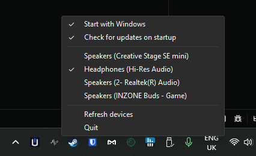

# Windows Audio Switcher

A Windows tray app that sets any audio device as the default for Console,
Multimedia, and Communications all at once - so Discord, games, and the rest of
Windows follow the same device instead of splitting across outputs.

Left or right click the tray icon, pick a device, done. Installed copies auto-update
from GitHub Releases.

## Why was it built?

I frequently switch between wireless earbuds, headphones and speakers as my output device - and Windows' native audio switcher only switches the default device, not the default communication device. This leads to an issue where Discord doesn't switch, leading to changing the device on Windows, then navigating into Discord's settings and switching that as well. It can also cause problems for games that have voice chat capabilities, and is very annoying to constantly workaround.

## App Features

### Extremely Lightweight
App is ~11.8 MB downloaded, and only requires ~4MB of memory, which Windows trims to ~2MB at idle. Only has what you need to switch audio as quick as possible.

### Device-change notifications (event-driven, delivered by Windows' Core Audio IMMNotificationClient):
- Device added - a new audio endpoint appears (USB device plugged in, Bluetooth paired/connected)
- Device removed - an endpoint disappears (USB unplugged, Bluetooth disconnected)
- Device state changed - plug/unplug or enable/disable of an existing endpoint (e.g. jack insertion/removal on your motherboard audio)
- Default device changed - the default output changes for any role: your own tray switch, a change in Windows Settings, or another app switching it
- Property changed - endpoint metadata changes (e.g. a device renamed)

## Codebase

### Tech-stack
Tauri. Was originally built to be a SvelteKit/Tauri project - but the WebView is unnecessary bloat. Was stripped to just be a taskbar tray icon + context menu. All that's needed and uses much less RAM (and storage).

### Versioning
The repo pins `version = "1.0.0"` in Cargo.toml; release versions come from the git tag instead. Tag `v1.0.6`, the release workflow builds and publishes 1.0.6, and installed copies auto-update.

## Credits

App icon by [upnow-graphic](https://www.flaticon.com/authors/upnow-graphic) on Flaticon.
